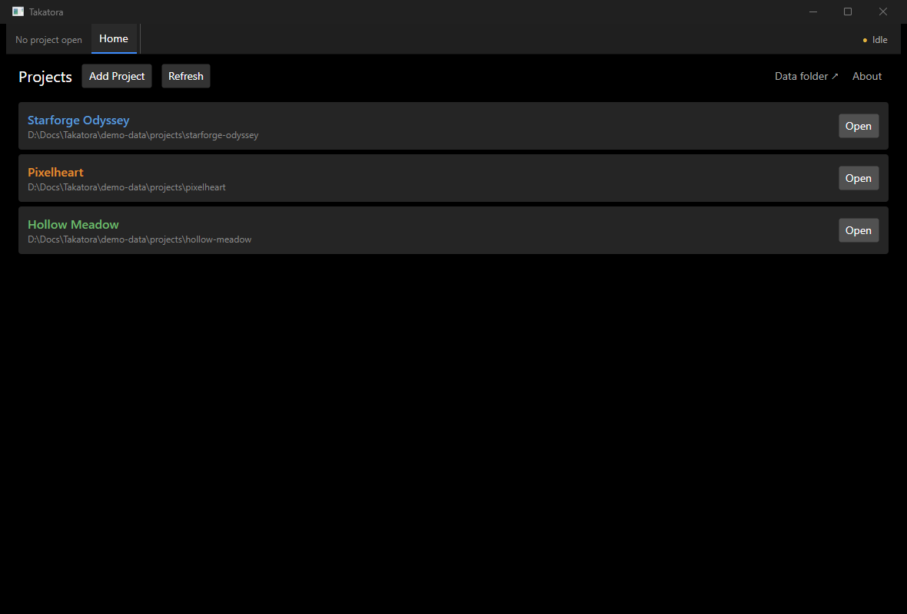
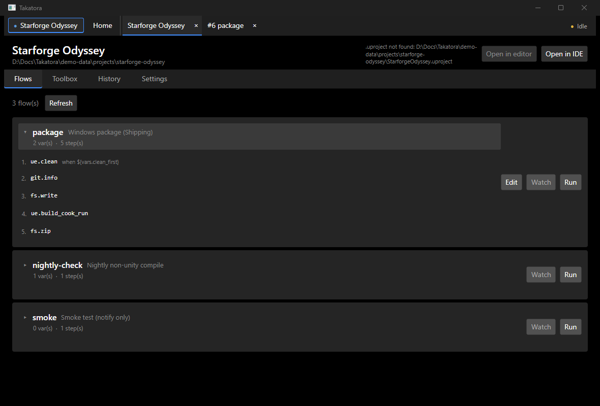
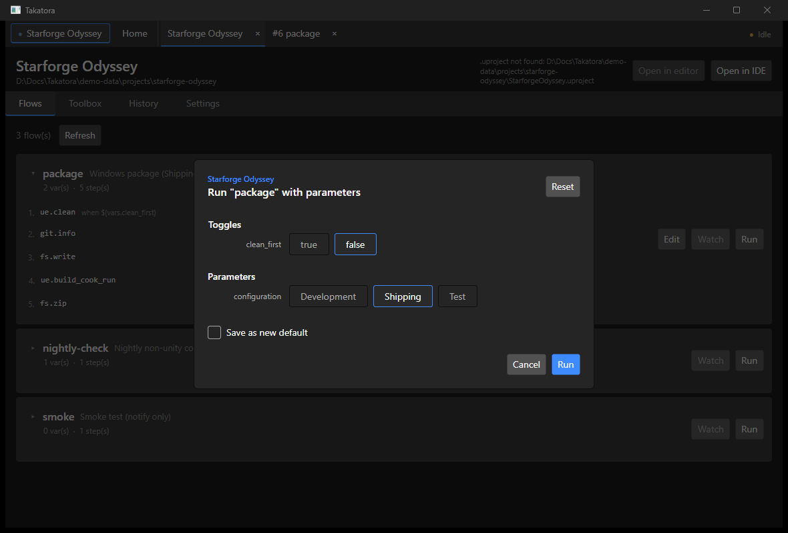
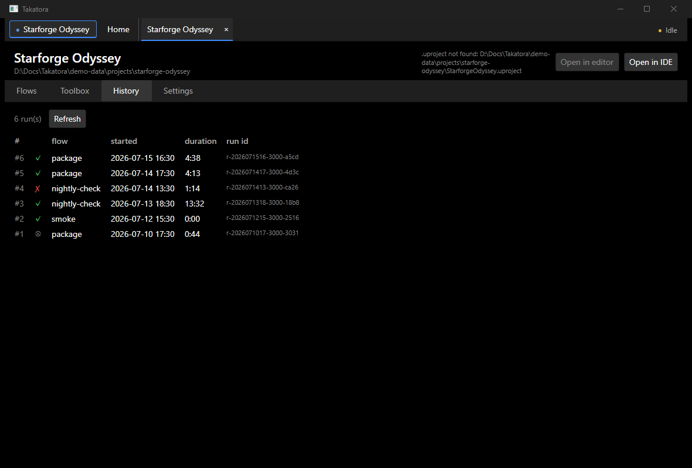
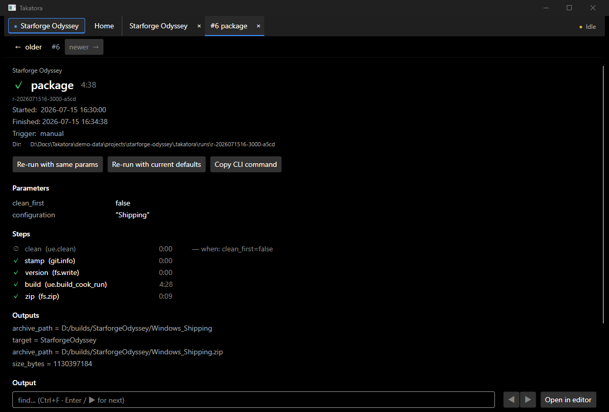
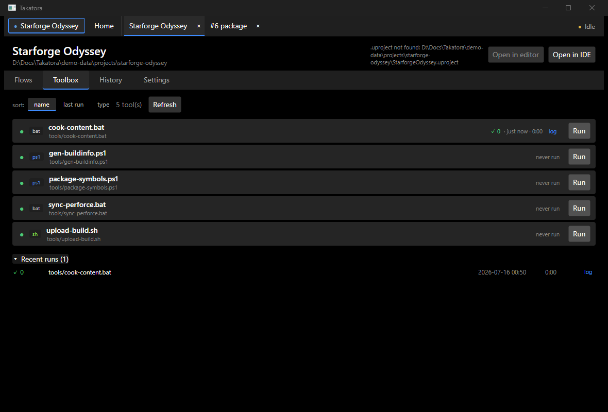

# GUI tour

A walkthrough of the Takatora desktop GUI (Avalonia). The screens below use a
throwaway demo dataset — the projects, flows, and history shown are fictitious.

## Projects (Home)

The Home tab lists every registered project, tinted by engine (Unreal blue,
Unity orange, Godot green). **Open** a project to work with its flows, history,
settings, and toolbox. **Add Project** scaffolds or registers one.

## Flows

Each flow from `.takatora/flows.toml` is a card showing its variables and steps.
Expand one to see the ordered steps (with `when` conditions), **Edit** it in the
flow editor, arm a **Watch** (auto-run on new commits), or **Run** it now.

## Run with parameters

Running a flow with variables opens a parameter dialog: toggles for boolean vars
that gate steps, enum pickers, and free-form fields. Optionally save the choices
as the flow's new defaults.

## History

Every run is recorded under `.takatora/runs/`. The History tab lists them newest
first with result (✓ success, ✗ failure, ⊗ cancelled), flow, start time,
duration, and run id. Click a row for full detail.

## Run detail

A past run's parameters, per-step results (including skipped steps and why),
recorded step **outputs** (e.g. a package's `archive_path` / `size_bytes`), and
the full log. **Copy CLI command** reconstructs the equivalent
`takatora run … --var …` invocation (secrets omitted); **Re-run** repeats it with
the same params or the current defaults.

## Toolbox

The Toolbox discovers helper scripts (`.bat` / `.cmd` / `.ps1` / `.sh`) under the
directories configured in Settings, without modeling them as flows. Toggle a tool
on/off, sort the list, and run one with a click — each run records its exit code,
duration, and log under a collapsible **Recent runs** list (kept out of the flow
history).
